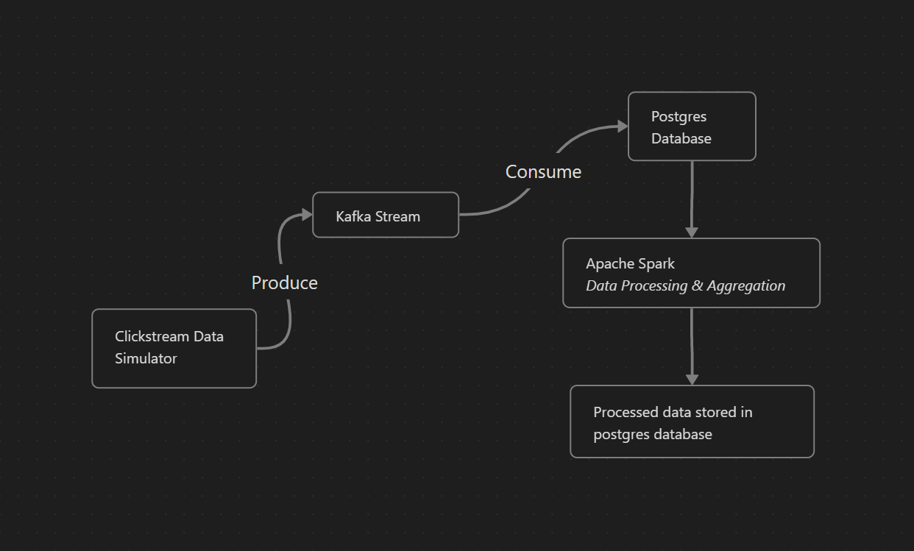

# clickstream-pipeline
### Clickstream pipeline creation procedure

- Install Java JDK and export path in *.bashrc* if *java --version* command is not recognised
- Download and extract kafka

```bash
$ tar -xzf kafka_2.13-3.5.0.tgz
$ cd kafka_2.13-3.5.0
```

- Start kafka environment

```bash
# Start the ZooKeeper service
$ bin/zookeeper-server-start.sh config/zookeeper.properties
```

```bash
# Start the Kafka broker service
$ bin/kafka-server-start.sh config/server.properties
```

- Create topic

```bash
$ bin/kafka-topics.sh --create --topic clickstream-events --bootstrap-server localhost:9092
```

- Start postgres server and create database and table

```bash
create database clickstream;
```

```bash
create table clicks(
	eventID int primary key,
	userID int,
	dt timestamp without time zone,
	url varchar(30),
	country varchar(30),
	city varchar(30),
	browser varchar(20),
	os varchar(20),
	device varchar(30)
);
```

- Install required modules using
```bash
pip3 install -r requirements.txt
```
- Run *dataSim.py* to create dummy data and which will be used to create events in *clickstream-events* topic.
- Run *sink.py* to consume the data and sink to the postgres database
- Download and place the below file in a folder that will be later referenced in pyspark

```bash
wget https://jdbc.postgresql.org/download/postgresql-42.6.0.jar
```

- Use Pyspark to process the data and save in a new table OVERVIEW

---

### Roadmap



---

### Further Development
1. Introduction of search engine like Elasticsearch for analyzing through web application
2. Orchestrating the entire pipeline with tools like Apache-Airflow
